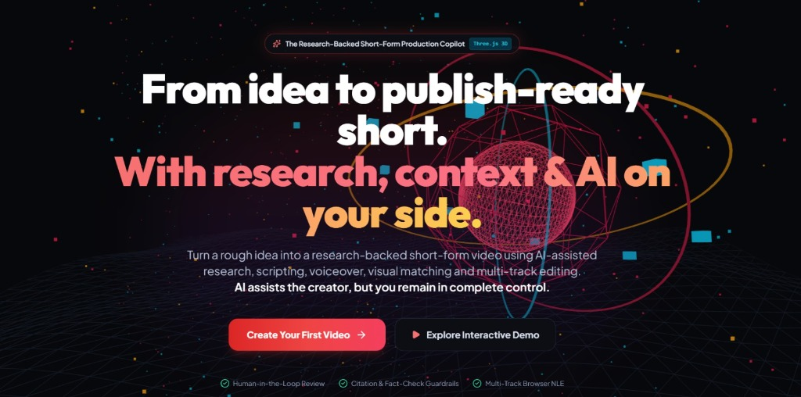
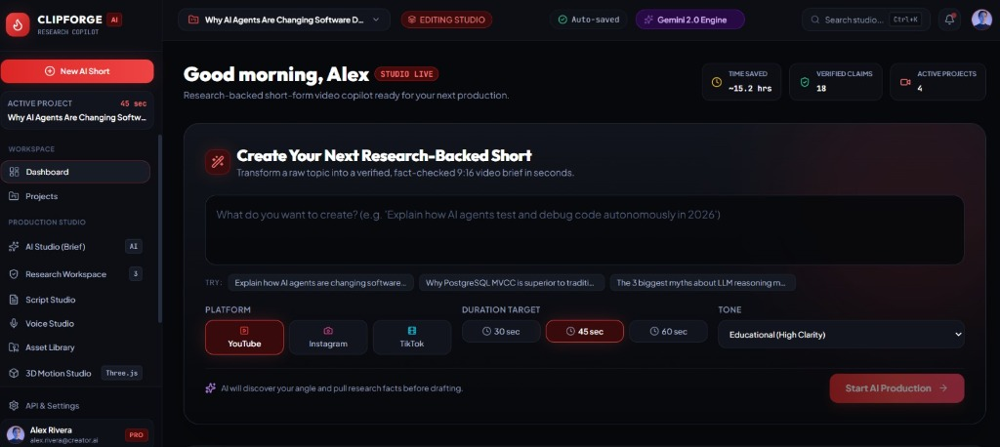
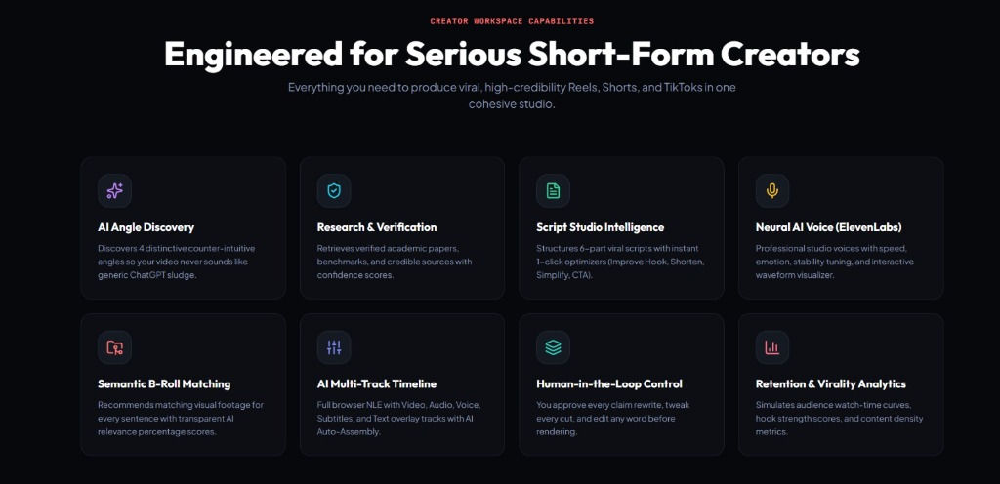

# ClipForge AI



ClipForge AI is a complete setup for an autonomous, research-backed short-form video production platform. It connects a modern React frontend with a powerful backend orchestrated by n8n, Telegram, Google Gemini, and ElevenLabs.

## Screenshots

### Studio Dashboard


### Creator Capabilities


## Architecture Overview

1. **Frontend**: A React (Vite) application styled for serious content creators, acting as the primary landing page and studio UI. It securely connects to the Telegram bot to launch the AI workflow.
2. **Backend**: An automated `n8n` workflow running in a Docker container.
3. **AI Pipeline**:
   - **Research & Angle**: Gemini API
   - **Neural Voice**: ElevenLabs API
   - **Rendering Engine**: FFmpeg triggered via a Python rendering script.
   - **Interface**: Interacts seamlessly with the creator through a Telegram Bot.

## Setup Guide

### Prerequisites
- Docker & Docker Compose
- Node.js & npm (for the frontend)
- ngrok (for tunneling webhooks)
- API Keys: Telegram Bot Token, Gemini API, ElevenLabs API, Google/YouTube OAuth.

### 1. Start the Backend
The backend runs locally via Docker, using a custom Alpine image to handle system dependencies like FFmpeg and Python.

1. Navigate to the `backend/` directory:
   ```bash
   cd backend
   ```
2. Create your `.env` file (based on your configuration) inside the `backend` directory with your API keys.
3. Build and launch the containers:
   ```bash
   docker compose up -d --build
   ```

### 2. Configure ngrok Webhook
The n8n workflow requires a public HTTPS URL to communicate with Telegram and YouTube OAuth.

1. Start ngrok:
   ```bash
   ngrok http --domain=YOUR_NGROK_DOMAIN 5678
   ```
2. Ensure your backend `.env` file sets `WEBHOOK_URL` and `N8N_EDITOR_BASE_URL` to this ngrok domain.
3. Restart the container to apply changes:
   ```bash
   docker compose up -d --force-recreate n8n
   ```

### 3. Run the Frontend
1. Navigate to the `frontend/` directory:
   ```bash
   cd frontend
   ```
2. Install dependencies:
   ```bash
   npm install
   ```
3. Set your keys in the `.env` file in the frontend directory.
4. Run the development server:
   ```bash
   npm run dev
   ```
5. Click **Launch ClipForge on Telegram** on the web platform to begin generating your videos!

## License
MIT